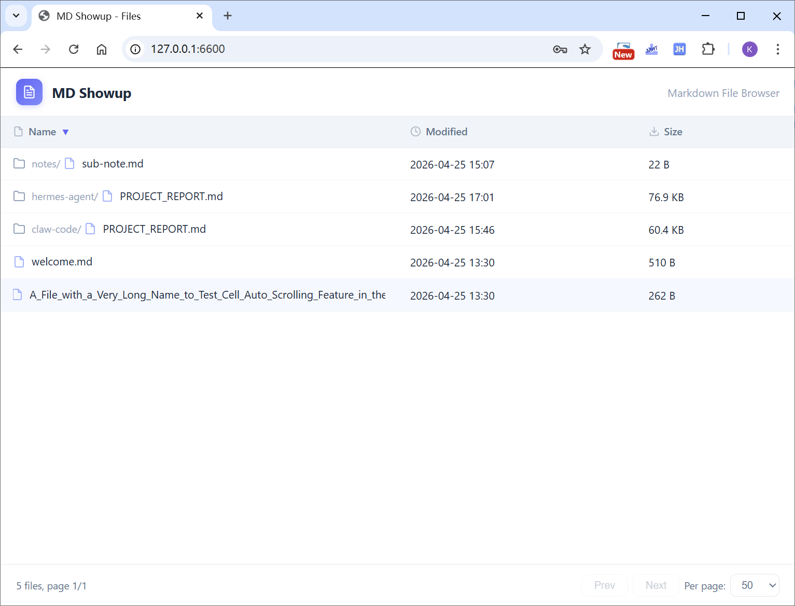
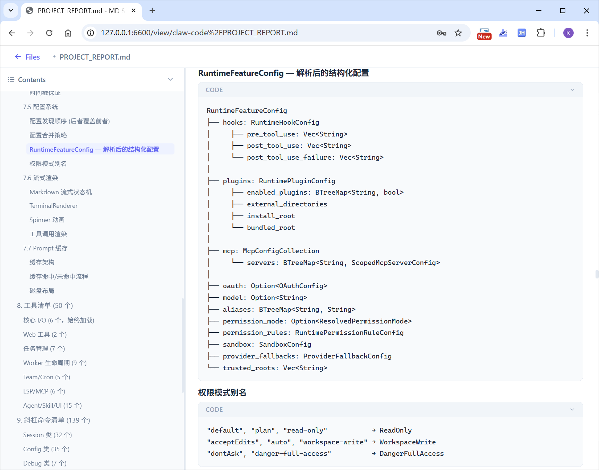

# MD Showup

A modern Markdown file browsing website built with Flask. Browse, sort, and render Markdown files from any directory with a clean, responsive UI.

(This project is coding by AI)

## Screenshots




## Features

- **File List** — Windows Explorer-style table with sortable columns (name, modified time, size), pagination with adjustable page size
- **Cell Auto-Scroll** — Long filenames auto-scroll horizontally on hover (scroll → pause 2s → scroll back → pause 2s → repeat)
- **Markdown Rendering** — Client-side rendering with markdown-it + highlight.js syntax highlighting
- **Collapsible TOC** — Left sidebar table of contents with drag-to-resize divider, double-click to reset
- **Collapsible Code/Quote Blocks** — Click to fold/unfold code blocks and blockquotes
- **API Key Auth** — Simple API key authentication with 24-hour session cookies
- **Recursive Scanning** — Scans all subdirectories, shows directory path prefix in file list
- **Persistent Settings** — Sort state, page size, TOC width/ratio, TOC collapse state, reopen button position all saved to localStorage
- **CJK Monospace Font** — Self-hosted Noto Sans Mono CJK SC for proper Chinese + monospace alignment in code blocks
- **Math Rendering** — KaTeX for LaTeX math: inline `$...$` and block `$$...$$`, all self-hosted

## Quick Start

```bash
# 1. Install dependencies
pip install -r requirements.txt

# 2. Configure
cp config.py.template config.py
# Edit config.py: set API_KEY, SESSION_SECRET, MD_DIRECTORY, PORT

# 3. Run
python app.py
```

Open `http://localhost:<PORT>` in your browser. Enter the API key you configured to log in.

## Configuration

All settings are in `config.py`:

| Setting | Description | Default |
|---------|-------------|---------|
| `API_KEY` | Key required to access the site | `"your-secret-api-key-here"` |
| `MD_DIRECTORY` | Root directory to scan for `.md` files | `"./md_files"` |
| `SESSION_SECRET` | HMAC secret for signing session cookies | — |
| `SESSION_DURATION_HOURS` | How long a session lasts | `24` |
| `DEFAULT_PAGE_SIZE` | Default files per page | `50` |
| `PORT` | Server port | `5000` |

## Project Structure

```
├── app.py                  # Flask app: routes, auth hook
├── auth.py                 # Session key issue/validate/revoke (HMAC-signed)
├── config.py               # Configuration (not in repo)
├── config.py.template      # Configuration template
├── file_service.py         # Directory scan, sort, paginate, file read
├── requirements.txt        # Python dependencies
├── screenshots/            # App screenshots (TODO)
├── static/
│   ├── css/style.css       # Full-viewport layout, modern UI
│   ├── fonts/              # Self-hosted Noto Sans Mono CJK SC
│   ├── js/
│   │   ├── auth.js         # Login UI, cookie check
│   │   ├── file-list.js    # Table render, sort, pagination, cell auto-scroll
│   │   ├── files-page.js   # File list page init
│   │   ├── md-viewer.js    # Markdown render, TOC, divider, collapsible blocks
│   │   ├── utils.js        # localStorage helpers, cookie reader
│   │   └── viewer-page.js  # Viewer page init
│   └── vendor/             # Self-hosted JS/CSS libraries
│       ├── markdown-it.min.js
│       ├── highlight.min.js
│       ├── katex.min.js
│       ├── katex.min.css
│       ├── katex-fonts/    # KaTeX woff2 fonts
│       └── github.min.css
├── templates/
│   ├── files.html          # File list page
│   └── viewer.html         # Markdown viewer page
└── md_files/               # Default markdown directory
```

## URL Structure

- `/` — File list page
- `/view/<path>` — Markdown viewer for a specific file (bookmarkable, shareable)
- `/api/login` — POST: authenticate with API key
- `/api/files` — GET: paginated file list (JSON)
- `/api/file/<path>` — GET: file content (JSON)

## Tech Stack

- **Backend**: Python + Flask
- **Frontend**: Vanilla HTML/CSS/JS (no frameworks)
- **Markdown**: markdown-it (client-side)
- **Syntax Highlighting**: highlight.js (client-side)
- **Math**: KaTeX (client-side, self-hosted)
- **Font**: Noto Sans Mono CJK SC (self-hosted)

## License

MIT
